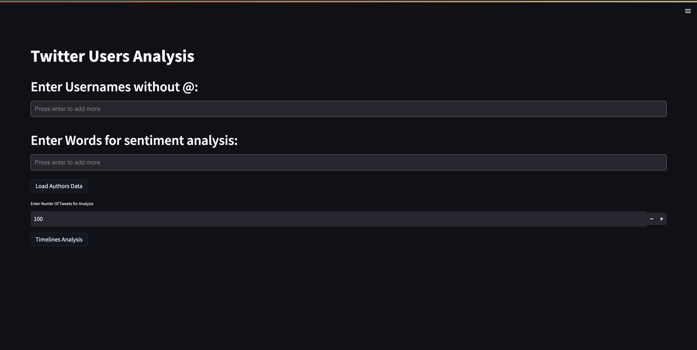

## Tool Description

The tool has a multi-purpose usage. 

- Investigating a single account: The first and simple one being as a tool to get idea about a single account behaviour - basic tweet patterns, like tweet timing pattern and type of tweets (textual or non-textual) a user is doing. Also, if a account is new to you can check the sentiments of the account around a particular keyword or even a string and get an idea of its motives  

- Analysing multiple accounts together: The 2nd and more useful one as a investigation tool analysing a pattern similarity among behaviour of different accounts. We can look for similarity for as many accounts as we want. We can select on how many tweets; say top 1000 or 2000 tweets of each user we want to do analysis on. Just the processing time will increase. It can be used to get idea about people working together for a same cause: 

- 1. Finding good guys: Normally the tools show up to catch something negative but our tool can be used to get something positive out of it also. We can find common pattern among people if the talk about same issue as of our interest or we can find if they are part of the same network  

- 2. Finding bad guys: The way it works, it looks for good guys and bad guys in the same way but when catching bad guys for say some guys running propaganda, we can find their network (because these accounts pop-up just before an event) with less no. of followers and large number of tweets these group of account try to create nuisance. These accounts show “bot behaviour” and just copy paste the tweets to increase the no. of tweets around a particular issue. Using one of the features that gives out the similar tweets’ accounts have done. We can easily spot these group of account along with the particular tweet that is being circulated in large number. Also, the network graph will show the common connection between these accounts and might lead us to the head account operating them from centre of the network graph 

The Demo is also on the positive use of this tool: 

Demo description: We have entered four accounts and word “people” around which we want to see their sentiments. And we are doing analysis of sentiments and similarity on recent 100 tweets of each user.  

Note: No. of users and no. of tweets to be analysed is a user input and can be as many as per the requirement. We recommend 500-1000 tweets for accurate results 

- We will get the the around which these users are most active in a day 

- We can get the type of tweets they do, textual or non textual 

- Word cloud of each user 

- Follower following list of all user, can be downloaded in csv 

- We will also get the info of all the 100 tweets of each user, i.e., the histogram shows how many of these 100 tweets of each user has a positive or negative or neutral sentiment 

- We will get to see the average sentiment of each user around the entered word, here-people 

- At last, we will get an option to download the similar tweets between above entered accounts. Similarity threshold we have kept 70% and above, but it can be increased to 90% or more when trying to analyse the “bad guys” and bot accounts 

 

## Novelty of the Tool 

- The tool takes care of tweets in different languages while comparing similarities as well as sentiments, this although take more time for processing but it increases the accuracy of our result 

 - The tool can be used to find like-minded people, so that one can start interact with them as well as to bust people running a propaganda. So, unlike most tool which focuses to find out only the bad in something. Here, we are trying to look for something good also.  

 

- The tool gives us all common or similar tweets a group of accounts does the similarity is now fixed to 80% but can be raised to more and we can spot bot accounts easily which just copy paste the same tweet on a particular issue and try to create havoc but creating a “tweet-flood” 

## Installation

### Please follow the steps below to download the app and the code for the tool and start working on our tool:  

1. Fork the Following Repository https://github.com/shivansh-sethi-2000/Twitter_User_Analysis.git

2. Download the cardiffnlp and universal-sentence-encoder_4 folders from the link : https://drive.google.com/drive/folders/1mOe2WVAit0AakFINY3k1iaVLoP4ExO8n?usp=sharing and place the cardiffnlp and universal-sentence-encoder_4 folders in the same directory.

3. Move to the tool's directory and install the required Packages

        pip install -r req.txt

4. add your API keys and sceret to my_tokens.py file

## Usage
1. To run the Script use the following command

        streamlit run User_Script.py

2. It will Take you to your Web Page If not you can use the Url showing in your terminal

3. The HomePage will Look Like this
    

## Additional Information
- Next Steps would include improving network graphs of Users for better analysis and image tweet analysis.
- there are some restrictions in using twitter API and same are applied here. Also, the text pre processing might take a liitle time for medium-large datasets.
- the network graph will currently contain only latest 500 connections rather than all of them.
